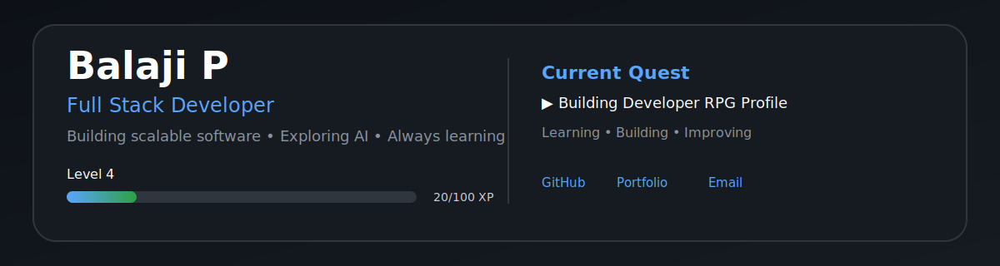
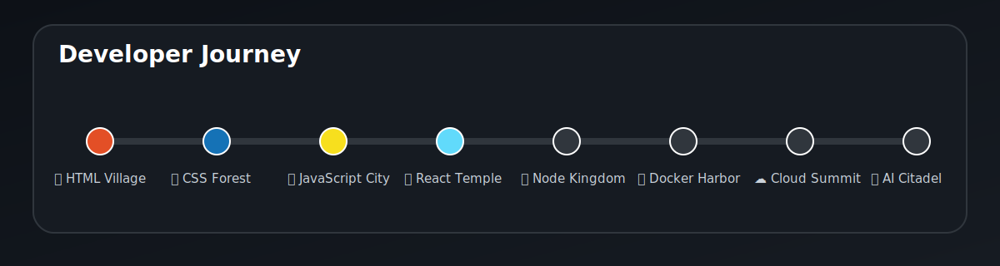
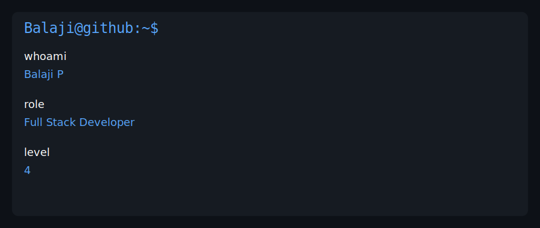
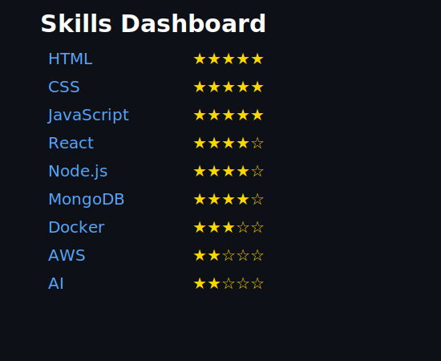
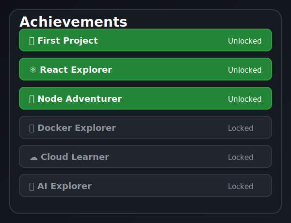

<h1 align="center">Hi 👋, I'm Balaji P</h1>

<h3 align="center">
Full Stack Developer • Problem Solver • Continuous Learner
</h3>

---

# 🗺 Developer Journey

---

# 💻 Developer Terminal

---

# ⚡ Skills Dashboard

---

# 🏆 Achievements

---

# 📊 GitHub Statistics

---

# 🚀 Current Focus

- Building Full Stack Applications
- Learning AI & Machine Learning
- Strengthening Data Structures & Algorithms
- Creating Open Source Projects

---

# 🌐 Connect With Me

- 💼 Portfolio: https://balaji-codes-light.lovable.app/
- 📧 Email: balajp.01r@gmail.com
- 💼 LinkedIn: https://linkedin.com/in/balaji-p

---

⭐ Thanks for visiting my profile!

